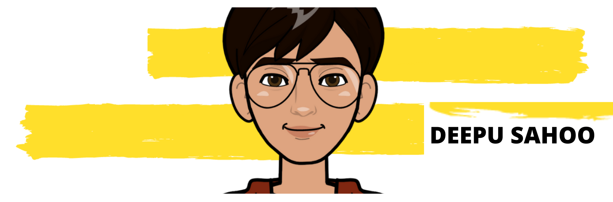

<h2>Hey! 👋</h2>

 

I'm Deepu Sahoo! 
- <i>Currently:</i> Working as  a Freelancer Web Developer. 

<!-- <h4>Projects </h4> -->

__Projects__
is a challenge that I created for myself to get proficient in Web Development by building  Projects with increasing complexity. 

__Check out my GitHub repository:__

  

    
    
  

<h2> About Deepu⚡:</h2>

I'm a Graduate Student living in Bhubanesware (odisha), India. Outside Tech, I love to read, enjoy music and explore nature outdoors. If you are around Bhubanesware, drop an email and let's catch-up over Coffee!
 
- Write to me: [ConnectWith@gmail.com](mailto:deepusahoo97@.com)

<!--
**07Deepu/07Deepu** is a ✨ _special_ ✨ repository because its `README.md` (this file) appears on your GitHub profile.

Here are some ideas to get you started:

- 🔭 I’m currently working on ...
- 🌱 I’m currently learning ...
- 👯 I’m looking to collaborate on ...
- 🤔 I’m looking for help with ...
- 💬 Ask me about ...
- 📫 How to reach me: ...
- 😄 Pronouns: ...
- ⚡ Fun fact: ...
-->
